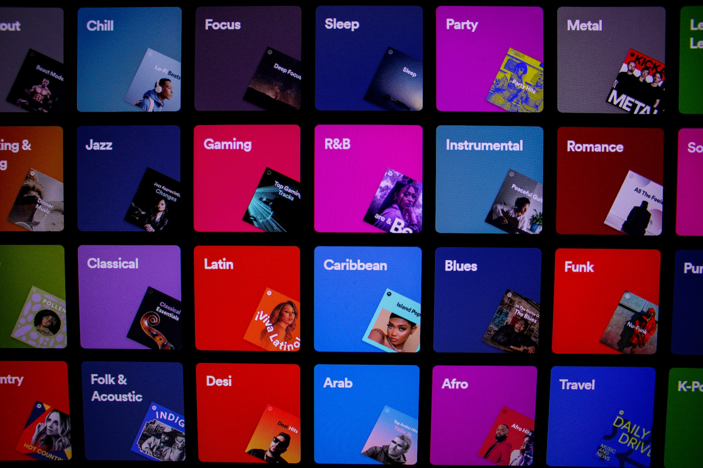
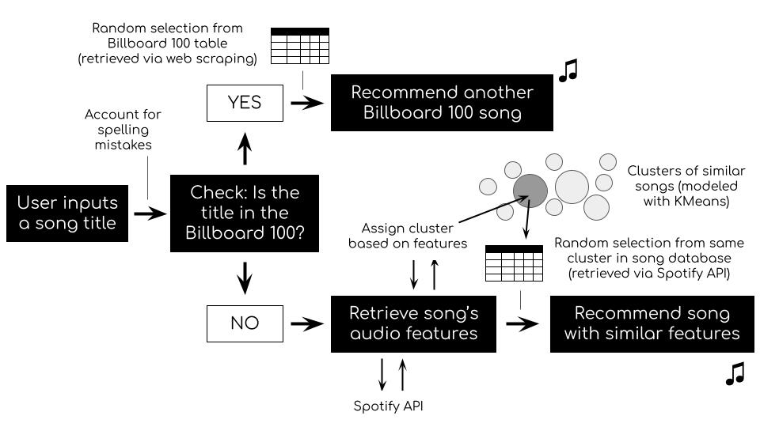

## SPOTIFY SONG RECOMMENDER

#### Project by Sebastian Bobeth
Ironhack bootcamp, November 2023

## PROJECT AIM
To develop a song recommender by using web scraping / the Spotify API service and modeling with KMeans (unsupervised Machine Learning algorithm).

## TECH USED
The complete procedure was done in Python (Jupyter Notebook). The main focus was on the following steps and modules:
- Data cleaning, feature selection (Pandas)
- Web scraping (Beautiful Soup)
- API (Spotipy)
- Machine learning (Scikit-Learn: KMeans)

## FINAL PRODUCT
The developed song recommender follows the following logic:

After training and testing a variety of models (see 'model' folder), the model that made the best recommendations was 'A2.1-ST45'. This model was trained on standardized variables and assigned the songs in the database to 45 clusters.

## HOW TO USE THE REPO
To use or further develop the song recommender, please fork the repo. The model

## ACKNOWLEDGMENT
Cover photo by <a href="https://unsplash.com/@davfts?utm_content=creditCopyText&utm_medium=referral&utm_source=unsplash">David Pupăză</a> on <a href="https://unsplash.com/photos/a-bunch-of-different-colored-pictures-on-a-wall-Km5J-KCP1Mw?utm_content=creditCopyText&utm_medium=referral&utm_source=unsplash">Unsplash</a>.
